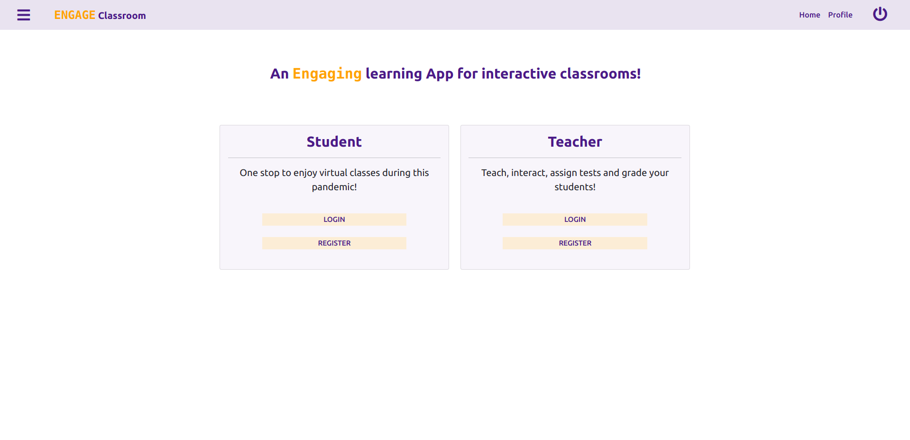

# microsoft-engage-classroom-app
Build a prototype of digital academic and social tools to help students and teachers during pandemic.

## Getting Started
These instructions will get you a copy of the project up and running on your local machine for development purposes.

### Prerequisites
1. Install Node.js  (https://nodejs.org/en/download/)
2. SignUp MongoDB (https://www.mongodb.com/)

### Installing
1. Clone the github repo using command line:
```
git clone https://github.com/ArshitaKalra/microsoft-engage-classroom-app.git
``` 
2. Using command line go to the microsoft-engage-classroom-app directory
```
cd microsoft-engage-classroom-app
```
3. Once in the App directory install the package.json
```
npm install
```
4. Run the application
```
node server.js
```
5. If successfull you should see the following message on you command line, 
```
App listening on PORT 8000
```


